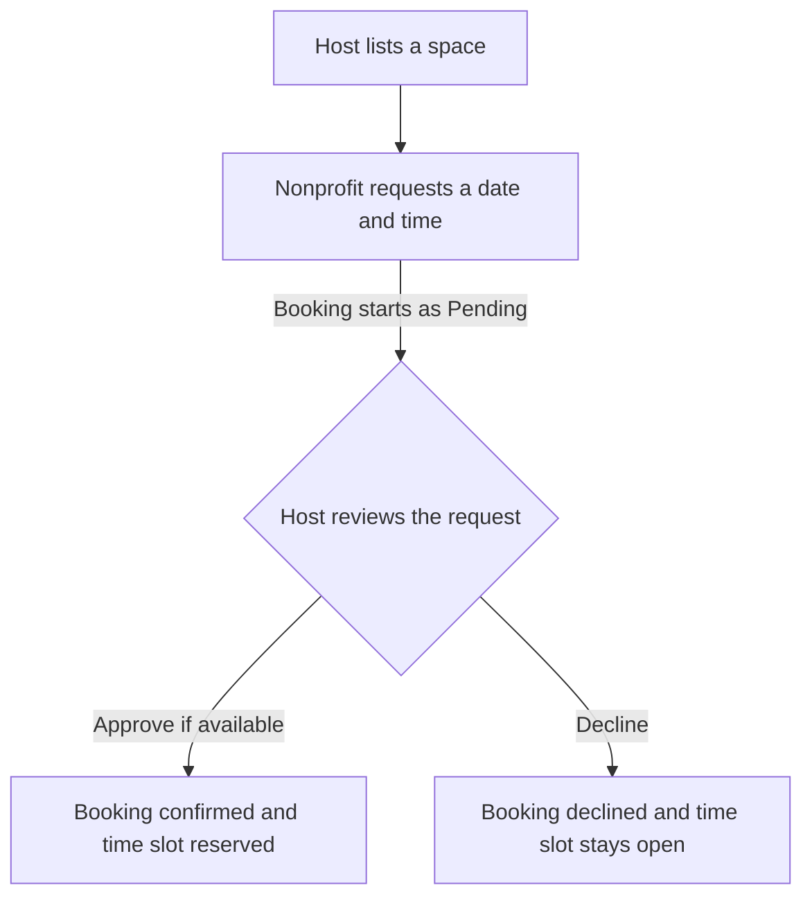

```mermaid
flowchart TD
    A["Host lists a space"]
    B["Nonprofit requests a date and time"]
    C{"Host reviews the request"}
    D["Booking confirmed and time slot reserved"]
    E["Booking declined and time slot stays open"]

    A --> B
    B -->|Booking starts as Pending| C
    C -->|Approve if available| D
    C -->|Decline| E
```

